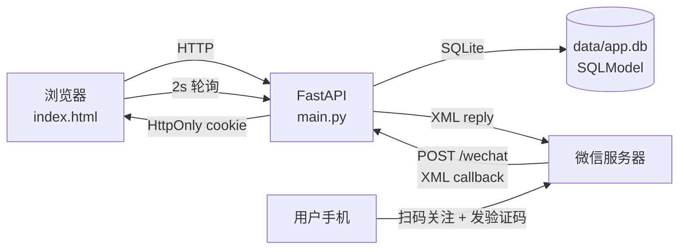
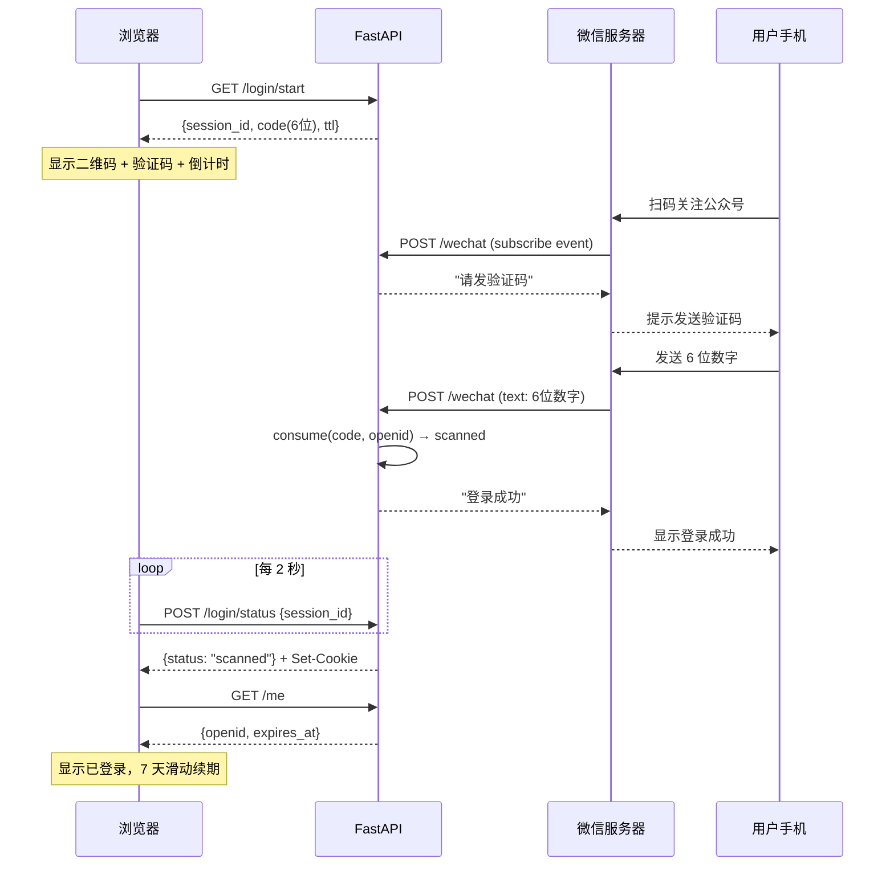
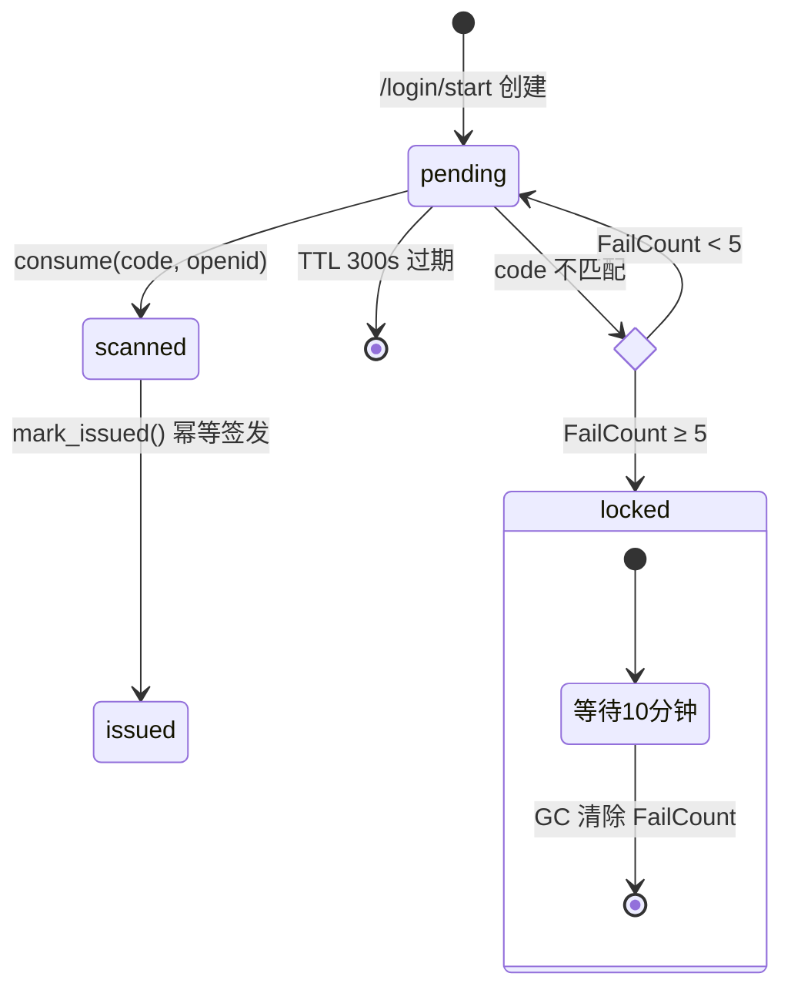

# wechat-passcode-login

微信公众号扫码口令登录 — 扫码关注公众号 + 发送 6 位验证码完成网页登录，不依赖微信认证服务号资质。

## 架构



---

## 使用

### 配置

1. 复制 `.env.example` → `.env`，填：

```
WECHAT_APP_ID=wx...
WECHAT_TOKEN=<3-32 位英数>    # 与微信后台「服务器配置」Token 一致
WECHAT_AES_KEY=<43 位>        # 安全模式必填；明文模式留空
HOST=0.0.0.0
PORT=8000
```

**fail-fast**：缺 `WECHAT_APP_ID` / `WECHAT_TOKEN` 启动直接 raise。

2. 将公众号二维码图片放到 `static/qrcode.jpg`（从微信公众平台后台「公众号二维码」下载）。

### 微信公众平台后台配置

**设置与开发 → 基本配置 → 服务器配置**：

| 字段 | 值 |
|---|---|
| URL | `http://<your-ip-or-domain>/wechat`（80/443 端口） |
| Token | 与 `.env` 的 `WECHAT_TOKEN` 一字不差 |
| EncodingAESKey | 点「随机生成」，写入 `.env` 的 `WECHAT_AES_KEY` |
| 消息加密方式 | **安全模式** 或 **明文模式**（代码两者都支持） |
| 数据格式 | XML |

提交时微信发 `GET /wechat?signature=...&echostr=...`，服务做 SHA1 校验通过后回 `echostr`。

> 服务号需先把服务器**公网出口 IP** 加到「IP 白名单」，否则调微信 API 报 `errcode 40164`。

### 启动

```bash
uv sync
uv run python -m src.main
```

### API

| Method | Path | 用途 |
|---|---|---|
| GET | `/` | 登录页 HTML |
| GET | `/static/qrcode.jpg` | 公众号二维码 |
| GET | `/login/start` | 创建 session，返回 `{session_id, code, ttl}` |
| POST | `/login/status` | body `{session_id}` → `{status: pending\|scanned\|expired}`；scanned 时下发 cookie |
| GET | `/me` | 读 cookie，返回 `{openid, expires_at}` 或 401；命中即续期 |
| POST | `/logout` | 撤销 cookie + db 行 |
| GET | `/wechat` | 微信验签 echostr |
| POST | `/wechat` | 微信事件回调（subscribe / text 6 位数字） |

### 模块

```
src/
  config.py        Settings + SQLModel engine + init_db
  models.py        LoginSession / FailCount / AuthSession
  session_store.py 6 位 code -> session 状态机；防爆破（5 次/openid）
  auth_store.py    cookie token <-> openid，token 存 SHA-256 hash
  crypto.py        WXBizMsgCrypt（AES-CBC，安全模式 AES + msg_signature）
  main.py          FastAPI：/login/start /login/status /me /logout /wechat
static/
  index.html       单文件前端（卡片 UI + 状态机 + 倒计时 + 自动刷新）
  qrcode.jpg       公众号二维码（gitignore，本地放）
```

---

## 登录流程



---

## 原理

### 为什么是「关注 + 验证码」

微信官方的"扫码登录"依赖 [带参二维码 `qrcode/create`](https://developers.weixin.qq.com/doc/service/api/qrcode/qrcodes/api_createqrcode.html)，仅限认证服务号。未认证号调用返回 `errcode: 48001 api unauthorized`，`user/info`、`sns/userinfo` 等用户接口同理。

**绕过路径**：用所有公众号都开放的两个接口：

| 接口 | 资质要求 | 用途 |
|---|---|---|
| 接收普通消息（POST 回调） | 任何公众号 | 收到用户发的验证码 |
| 被动回复用户消息（XML 响应） | 任何公众号 | 回"登录成功"提示 |

代价：用户多一步「在公众号里把 6 位数字发出去」。但**对未认证号是唯一可行的方案**。

### session_id 与 code

```
session_id (32B URL-safe 随机) ←→ code (6 位数字)
```

- **session_id**：浏览器轮询用，用户不可见，32 字节随机
- **code**：用户在微信里输入，6 位纯数字（100 万空间，手机键盘友好）
- 两者解耦：code 可过期重生成，session 独立管理生命周期
- TTL 300 秒，一次性消费，幂等签发（scanned → `issued` 防重复签发 cookie）

### 状态机与防爆破



三层防爆破：

| 层 | 策略 | 实现 |
|---|---|---|
| 1. 时间窗 | code 5 分钟过期 | `LoginSession.created_at` |
| 2. 一次性 | 命中即消费 | `mark_issued` 状态机 |
| 3. 单点限速 | 单 openid 错 5 次锁 10 分钟 | `FailCount` 表 |

> 当前没做 IP 维度限速 + 全局速率。生产规模下应加：同 IP 1 分钟最多 N 次失败、全局每秒 consume 调用上限。

### 安全设计

- cookie：`HttpOnly` + 可配 `secure` / `samesite`；token 存 SHA-256 hash，不存原值
- 同 openid 登录自动撤销旧 session（防多端冒用）
- session_id 通过 POST body 传递，不进 access log
- 签名校验用 `hmac.compare_digest` 防定时攻击
- 安全模式 AES-CBC：解密后校验 `receive_id == app_id`

### 局限

- 登录后只有 `openid`，没有昵称/头像（`user/info` 需认证）
- 想拿用户资料 → 需微信认证（¥300/年）→ 可改用 `qrcode/create` + `cgi-bin/user/info`
- JWT 无服务端撤销能力且 token 过长不适合手输；短链 redirect 需未认证号没有的网页授权；短信需资质 + 费用
